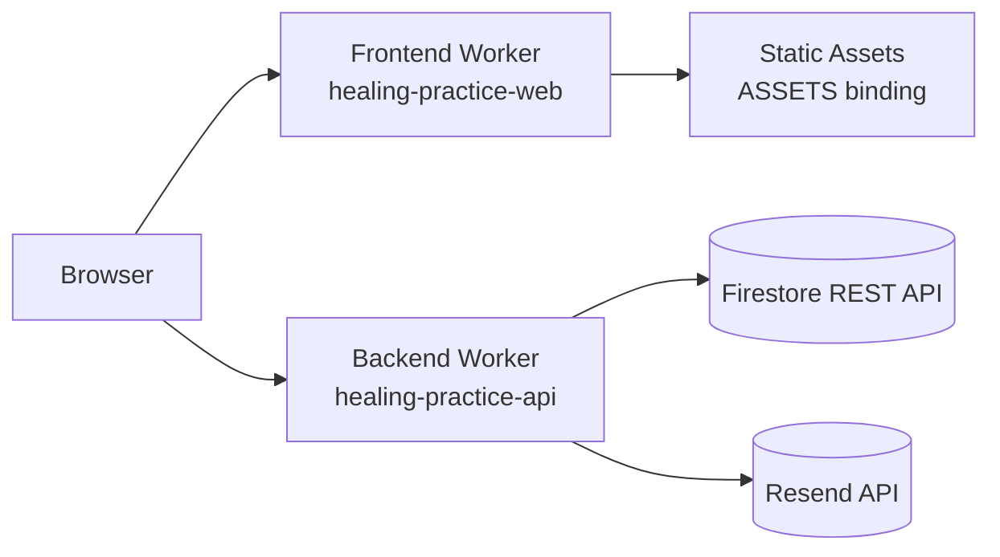

# Healing Practice — Counselling Platform

> Trauma-sensitive, LGBTQ+ affirming counselling platform using a **Workers-only edge architecture** (frontend Worker + backend API Worker).


---

## Table of Contents

- [1. System Overview](#1-system-overview)
- [2. Runtime Topology](#2-runtime-topology)
- [3. Monorepo Layout](#3-monorepo-layout)
- [4. Stack Matrix](#4-stack-matrix)
- [5. API Contract](#5-api-contract)
- [6. Local Development](#6-local-development)
- [7. Environment Model](#7-environment-model)
- [8. Scripts](#8-scripts)
- [9. Deployment](#9-deployment)
- [10. CI/CD Pipelines](#10-cicd-pipelines)
- [11. Security Model](#11-security-model)
- [12. Operational Runbook](#12-operational-runbook)
- [13. Repository Standards](#13-repository-standards)
- [14. Troubleshooting](#14-troubleshooting)

---

## 1. System Overview

This repository is a monorepo with three packages:

- `client/`: React SPA, built with Vite, served from Cloudflare Worker assets binding.
- `server/`: Hono API Worker (enquiry intake, health check, settings endpoint).
- `shared/`: shared TypeScript models/types.

### Design goals

- **Safety-first UX** for vulnerable users
- **Zero client-side Firestore writes**
- **Workers-only deployment surface** (no Pages runtime dependency)
- **Strict TypeScript + lint gate** on all PRs

---

## 2. Runtime Topology



### Request routing model

| Path             | Served By                      | Notes                                       |
| ---------------- | ------------------------------ | ------------------------------------------- |
| `/` + SPA routes | Frontend Worker                | SPA fallback to `index.html` for route URLs |
| `/api/*`         | Backend Worker                 | Hono routes and middleware logic            |
| Static assets    | Frontend Worker assets binding | Security headers injected at edge           |

---

## 3. Monorepo Layout

```text
.
├── client/
│   ├── src/
│   │   ├── worker.ts                # Frontend Cloudflare Worker entry
│   │   └── ...                      # React app source
│   ├── wrangler.toml                # Frontend Worker config
│   └── public/
├── server/
│   ├── src/
│   │   ├── index.ts                 # Backend Worker entry
│   │   ├── routes/
│   │   └── lib/
│   └── wrangler.toml                # Backend Worker config
├── shared/
├── docs/
├── .github/
│   ├── workflows/
│   ├── ISSUE_TEMPLATE/
│   └── instructions/
└── package.json
```

---

## 4. Stack Matrix

| Concern          | Technology                     | Notes                   |
| ---------------- | ------------------------------ | ----------------------- |
| Frontend app     | React 18 + Vite 5              | SPA                     |
| Frontend runtime | Cloudflare Worker              | `client/src/worker.ts`  |
| Backend API      | Hono on Cloudflare Workers     | `server/src/index.ts`   |
| Validation       | Zod                            | Client + server         |
| Data store       | Firestore (REST)               | Server-side only        |
| Email            | Resend API                     | Worker-side integration |
| Styling          | Tailwind CSS                   | strict project palette  |
| State            | Zustand                        | UI-level stores         |
| Tests            | Playwright (e2e), TS checks    | CI gated                |
| Hooks            | simple-git-hooks + lint-staged | pre-commit checks       |

---

## 5. API Contract

### Endpoints

| Method | Path            | Description                | Auth                             |
| ------ | --------------- | -------------------------- | -------------------------------- |
| `POST` | `/api/enquiry`  | Submit enquiry form        | Public (validated, rate-limited) |
| `GET`  | `/api/health`   | Runtime health probe       | Public                           |
| `GET`  | `/api/settings` | Banner/settings read model | Public read model                |

### `POST /api/enquiry` (payload)

```json
{
  "name": "Jane Doe",
  "email": "jane@example.com",
  "message": "I would like to enquire about availability...",
  "referralSource": "google_search",
  "website": ""
}
```

### Response behavior

- `201`: accepted and persisted
- `422`: validation failure
- `429`: rate-limited
- `500`: generic server-safe error (no internals leaked)

---

## 6. Local Development

### Bootstrap sequence

```bash
npm install
npm run setup:local
npm run setup:local:check
npm run dev
```

### Dev endpoints

| Service                | URL                     |
| ---------------------- | ----------------------- |
| Frontend (Vite)        | `http://localhost:5173` |
| Backend (Wrangler dev) | `http://localhost:8787` |

> The client Vite dev server proxies `/api` to backend Worker dev target by default.

---

## 7. Environment Model

### Local files

| File                | Purpose                           |
| ------------------- | --------------------------------- |
| `client/.env.local` | frontend runtime env (non-secret) |
| `server/.dev.vars`  | backend local secrets/config      |

### Backend required values

| Key                        | Required    | Purpose                             |
| -------------------------- | ----------- | ----------------------------------- |
| `FIREBASE_PROJECT_ID`      | Yes         | Firestore project scope             |
| `FIREBASE_CLIENT_EMAIL`    | Yes         | Service account principal           |
| `FIREBASE_PRIVATE_KEY`     | Yes         | Service account key                 |
| `RESEND_API_KEY`           | Recommended | Notification email delivery         |
| `ADMIN_NOTIFICATION_EMAIL` | Recommended | Recipient for enquiry notifications |
| `RESEND_FROM`              | Optional    | Verified sender override            |

---

## 8. Scripts

| Command                     | Purpose                                    |
| --------------------------- | ------------------------------------------ |
| `npm run dev`               | run frontend + backend locally             |
| `npm run lint`              | lint all workspaces                        |
| `npm run typecheck`         | TS check all workspaces                    |
| `npm run build`             | build shared + client + server             |
| `npm run test:e2e`          | Playwright e2e                             |
| `npm run setup:local`       | generate missing local env files           |
| `npm run setup:local:check` | validate local env file/value completeness |
| `npm run deploy`            | deploy frontend + backend (production)     |
| `npm run deploy:staging`    | deploy frontend + backend (staging)        |

---

## 9. Deployment

### Workers

- Frontend Worker config: `client/wrangler.toml`
- Backend Worker config: `server/wrangler.toml`

### Production deploy sequence

```bash
npm run deploy:frontend
npm run deploy:backend
```

### GitHub secrets required

- `CLOUDFLARE_API_TOKEN`
- `CLOUDFLARE_ACCOUNT_ID`
- `PRODUCTION_API_URL`

---

## 10. CI/CD Pipelines

| Workflow        | File                                  | Trigger            | Responsibility         |
| --------------- | ------------------------------------- | ------------------ | ---------------------- |
| CI              | `.github/workflows/ci.yml`            | PR + push          | lint, typecheck, build |
| Frontend deploy | `.github/workflows/deploy-pages.yml`  | push main / manual | deploy frontend Worker |
| Backend deploy  | `.github/workflows/deploy-worker.yml` | push main / manual | deploy backend Worker  |

---

## 11. Security Model

### Controls

- Firestore access restricted to backend Worker integration
- Honeypot anti-bot field on enquiry forms
- Request rate limiting at backend edge
- Input validation + sanitization before persistence
- Security headers applied by frontend Worker response pipeline

### Explicit non-goals

- No client-side Firestore SDK writes
- No raw backend stack traces in API responses

---

## 12. Operational Runbook

<details>
<summary><strong>Rotate backend secrets</strong></summary>

1. Update secret values in Cloudflare Worker environment.
2. Redeploy backend Worker.
3. Validate `/api/health`.
4. Submit a test enquiry and confirm persistence/notification path.

</details>

<details>
<summary><strong>Validate deployment integrity</strong></summary>

1. `npm run lint`
2. `npm run typecheck`
3. `npm run build`
4. `npm run test:e2e`
5. Deploy frontend, then backend.
6. Smoke test `/`, `/contact`, `/api/health`.

</details>

---

## 13. Repository Standards

- Contribution guide: `CONTRIBUTING.md`
- Security policy: `SECURITY.md`
- Support guide: `SUPPORT.md`
- Code of conduct: `CODE_OF_CONDUCT.md`
- Changelog: `CHANGELOG.md`
- Architecture docs: `docs/ARCHITECTURE.md`
- Deployment runbook: `docs/DEPLOYMENT.md`
- Local development guide: `docs/LOCAL_DEVELOPMENT.md`

---

## 14. Troubleshooting

| Symptom                      | Likely Cause                        | Action                                    |
| ---------------------------- | ----------------------------------- | ----------------------------------------- |
| Commit blocked at pre-commit | lint-staged failure                 | run `npm run lint` and fix reported files |
| API not reachable locally    | backend dev worker not running      | run `npm run dev:server`                  |
| `setup:local:check` fails    | missing required `.dev.vars` values | populate Firebase service account vars    |
| Deploy fails in CI           | missing repo secrets                | check workflow-required secrets list      |

---

### Notes

This is a private project with trauma-sensitive content and operational safeguards. If you need policy details, see `SECURITY.md` and `SUPPORT.md`.
